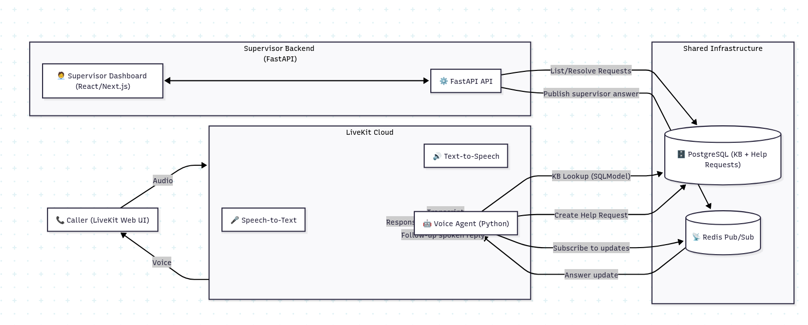

# Customer Support AI Agent Platform

A multi-tenant backend platform powering an AI-driven customer-support agent with human-in-the-loop workflows. The system integrates knowledge-base retrieval, LLM-powered phrasing, supervisor review, and LiveKit-based voice interactions.


Architecture Diagram:




## Architecture Overview

* **FASTAPI Backend** – Tenants, help-requests, KB, ranking logic, and orchestration.
* **PostgreSQL** – Main relational store and JSON KB storage.
* **LLM Integration** – Phrasing logic and fallback flows.
* **LiveKit Agent** – Handles real-time voice sessions.
* **React.js Frontend** – Supervisor dashboard.

## Key Components

### 1. FASTAPI Backend

* `GET /requests/pending` – View pending requests and add answers to KB.
* `GET /requests/resolved` – View resolved help requests.
* `POST /requests/{req_id}/answer` – Supervisor submits the final answer.

### 2. Agent Flow

* Fetch KB JSON articles for the business.
* Rank articles using custom algorithm.
* Pass top results → LLM → produce final response.
* If nothing matches → create human-review request.

### 3. Help Request System

* Automatically or manually created tickets.
* Stores caller details, notes, timestamps, and resolutions.

### 4. AI + Voice Stack

* LiveKit for real-time voice.
* LLM for text generation.
* Combined to form a natural conversational agent.

## Getting Started

### Agent Setup

#### Installation

1. Install Python 3.10+
2. Install **uv** package manager:

```
curl -LsSf https://astral.sh/uv/install.sh | sh
```

3. Create virtual environment:

```
uv venv
```

4. Activate environment:

```
source .venv/bin/activate
```

5. Install project dependencies:

```
cd agent/
uv sync
```

#### Start the Agent

```
uv run src/agent.py console
```

Configure DB credentials, LLM API keys, and LiveKit server details before running.

### Frontend (React.js)

```
npm install
npm run dev
```

## Possible Improvements

* Optimize KB ranking + retrieval.
* Add analytics per tenant.
* Expand conversational flows.
* We can also introduce semantic search using pgvector.

